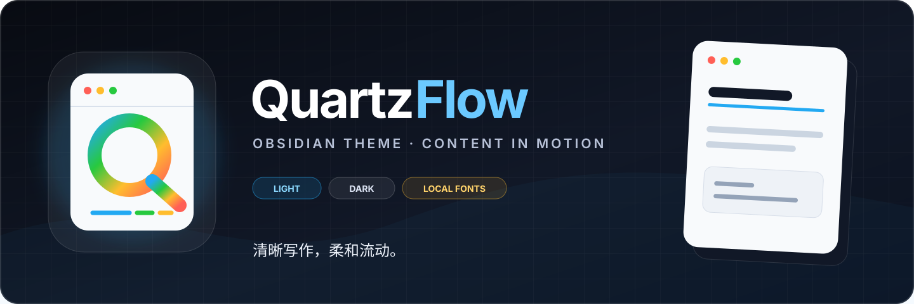

<p align="center">
  
</p>

<p align="center">
  <strong>清晰写作，柔和流动。</strong><br>
  一款从 Typora Escook 设计语言延伸而来的 Obsidian 明暗双模式主题。
</p>

## 特性

- **内容优先**：优化阅读视图、Live Preview 与源码模式的排版节奏。
- **完整界面**：统一文件栏、标签页、菜单、弹窗、Hover Preview 和设置页。
- **彩虹导航**：文件夹分组、文件图标与拖放目标提供清晰的层级反馈。
- **精修正文**：彩色标题、macOS 风格代码块、表格、引用和紧凑列表。
- **本地且自包含**：字体构建后内嵌到 `theme.css`，无远程请求或安装路径依赖。
- **可配置**：支持 Style Settings 调整颜色、字体、字号、宽度、圆角和密度。

## 安装

### 手动安装

1. 下载仓库中的 [`QuartzFlow`](./QuartzFlow) 文件夹。
2. 将它复制到 `<你的仓库>/.obsidian/themes/QuartzFlow/`。
3. 在 Obsidian 的 **设置 → 外观 → 主题** 中选择 **QuartzFlow**。

更新时覆盖该文件夹，然后重新加载 Obsidian。主题最低支持版本为 **Obsidian 1.12.0**。

> QuartzFlow 尚未声明已上架 Obsidian 社区主题目录；在正式通过审核前，请使用手动安装。

## 自定义

主题无需插件即可使用。安装社区插件 **Style Settings** 后，可在 **设置 → Style Settings → QuartzFlow** 中调整主要视觉参数。若某项设置未即时刷新，切换一次主题或重新加载应用。

## 开发

源码采用按加载顺序编号的模块化 CSS：

```text
src/
  00-settings.css     Style Settings 元数据
  01-fonts.css        本地字体声明
  02-tokens/          明暗模式与设计变量
  03-core/            Obsidian 官方变量映射
  04-editor/          正文、标题、代码、表格等
  05-app/             应用外壳与侧边栏
  06-components/      菜单、弹窗、表单和提示窗
  08-features/        彩虹文件夹、文件图标与特色交互
  99-safeguards.css   最后加载的兼容规则
QuartzFlow/
  manifest.json       主题元数据
  theme.css           生成的发布产物
  fonts/              构建时内嵌的字体源
```

需要 Node.js；项目没有运行时依赖。

```bash
npm run build         # 生成 QuartzFlow/theme.css
npm run dev           # 监听 src/ 并持续构建
npm run audit         # 检查路径、字体和 CSS 风险
npm run check         # 构建并执行完整静态检查
```

本地部署可运行 `npm run deploy -- --vault="<vault-path>"`，或将测试仓库路径写入被忽略的 `.vault` 文件。不要直接编辑生成的 `QuartzFlow/theme.css`。

## 发布

创建 GitHub Release 前：

1. 更新 `QuartzFlow/manifest.json` 的语义化版本。
2. 运行 `npm run check` 并在明暗模式下手动验证主要界面。
3. 创建与 manifest 版本一致的标签，例如 `1.0.0`。
4. 将 `QuartzFlow/manifest.json` 和 `QuartzFlow/theme.css` 作为 Release 附件上传。

这是 [Obsidian 官方主题发布流程](https://docs.obsidian.md/themes/app-themes/submit-theme) 要求的核心发布资产。

## 贡献

提交问题时请附上 Obsidian/操作系统版本、明暗模式、复现步骤和截图。代码贡献请阅读 [`AGENTS.md`](./AGENTS.md)，并提交同步重建后的 `QuartzFlow/theme.css`。

## 致谢与许可

QuartzFlow 基于 [刘龙宾](https://github.com/liulongbin1314) 的 [Typora Escook Theme](https://github.com/liulongbin1314/typora-theme) 继续设计与移植，感谢原作者提供的视觉基础。
